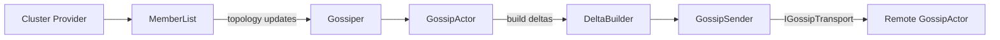
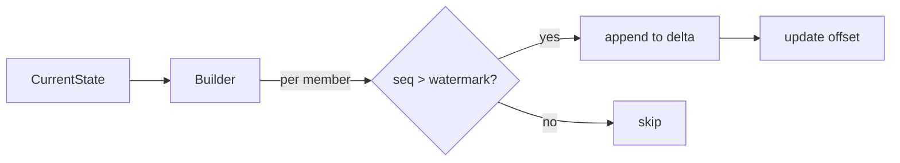

# Cluster Membership Gossip Flow

This document explains how cluster membership events are detected and how
membership state is propagated through gossip.

For a runnable demonstration, see [examples/ClusterGossip](examples/ClusterGossip).

## Architecture

The gossip subsystem is separated from the rest of the cluster code and
communicates through a small set of types. The main participants are shown
below:



* **Gossiper** – orchestrates the gossip loop and owns a `Gossip` instance
  that holds the replicated state.
* **GossipActor** – receives commands from the `Gossiper` and merges incoming
  state from other members.
* **GossipSender** – sends built deltas to remote nodes using an
  `IGossipTransport` implementation.
* **MemberStateDeltaBuilder** – determines which portions of the gossip state
  should be sent to a specific target.
* **IGossipTransport** – abstraction over the mechanics of sending a
  `GossipRequest`; the default `GossipTransport` simply forwards the request
  through `IContext.RequestReenter`.

## Detecting members

Cluster providers (e.g., Kubernetes) watch the environment for running nodes and
invoke `MemberList.UpdateClusterTopology` with the current set of members ([KubernetesClusterMonitor.cs](src/Proto.Cluster.Kubernetes/KubernetesClusterMonitor.cs#L304-L317)).
`UpdateClusterTopology` filters out blocked members, computes which members
joined or left, and constructs a `ClusterTopology` that includes `Joined`,
`Left`, and `Blocked` lists ([MemberList.cs](src/Proto.Cluster/Membership/MemberList.cs#L161-L240)).
The resulting topology is published to the node's local event stream via
`BroadcastTopologyChanges` ([MemberList.cs](src/Proto.Cluster/Membership/MemberList.cs#L349-L353)).

## Propagating membership to gossip

The `Gossiper` subscribes to `ClusterTopology` events. Each update is cloned with
its `Joined` and `Left` lists cleared before being forwarded to the `GossipActor`
for inclusion in the gossip state ([Gossiper.cs](src/Proto.Cluster/Gossip/Gossiper.cs#L190-L204)).
The gossip implementation stores the full membership under the `cluster:topology`
key and tracks active member IDs for later consensus checks ([Gossip.cs](src/Proto.Cluster/Gossip/Gossip.cs#L85-L92)).

## Gossip dissemination

The gossip loop periodically updates heartbeat information and sends the current
state to randomly chosen peers ([Gossiper.cs](src/Proto.Cluster/Gossip/Gossiper.cs#L232-L241), [Gossip.cs](src/Proto.Cluster/Gossip/Gossip.cs#L168-L205)).
Peers merge received updates, which allows membership changes to spread
throughout the cluster.

## Gossip transport

`GossipSender` performs the send using an `IGossipTransport` implementation.
The default `GossipTransport` issues a `GossipRequest` via
`IContext.RequestReenter`, invoking a continuation when a `GossipResponse`
arrives ([IGossipTransport.cs](src/Proto.Cluster/Gossip/IGossipTransport.cs#L14-L46),
[GossipSender.cs](src/Proto.Cluster/Gossip/GossipSender.cs#L21-L87)).
Custom transports can wrap this interface to add metrics, retries, or other
behaviour without modifying cluster code.

## Delta-based member state propagation

`MemberStateDeltaBuilder` constructs per-target deltas by tracking a watermark
for each `{target}.{member}` pair. The watermark represents the highest sequence
number previously sent to that target for a given member. During a build, values
with a higher sequence number are included in the delta and the watermark is
advanced:

```csharp
var watermarkKey = $"{targetMemberId}.{memberId}";
committedOffsets.TryGetValue(watermarkKey, out var watermark);
...
if (value.SequenceNumber <= watermark) continue;
if (value.SequenceNumber > newWatermark) newWatermark = value.SequenceNumber;
```

The builder stops once it has added updates for `_gossipMaxSend` members,
ensuring that large clusters do not overwhelm the network. Members exceeding
this limit are retried in later cycles:

```csharp
count++;
if (count >= _gossipMaxSend) break;
```

If no sequence numbers exceed the watermark, the member is omitted from the
delta and its watermark remains unchanged. This prevents redundant transmissions
but means updates may be delayed when the `gossipMaxSend` limit is hit.



The builder returns a `MemberStateDelta` record containing the new state and a
callback to commit offsets once the remote peer acknowledges receipt
([MemberStateDeltaBuilder.cs](src/Proto.Cluster/Gossip/MemberStateDeltaBuilder.cs#L19-L84),
[MemberStateDelta.cs](src/Proto.Cluster/Gossip/MemberStateDelta.cs#L11)).

## Isolation from the cluster

Gossip logic can now run without direct dependencies on cluster internals.
`Gossiper` wires the pieces together through `GossiperOptions`, supplying the
member list, block list, event stream and timing settings. This separation
allows testing and alternative transports by substituting implementations such
as `IGossipTransport` ([Gossiper.cs](src/Proto.Cluster/Gossip/Gossiper.cs#L47-L95)).

## Member states

- **Joined / Left** – Calculated by `MemberList.UpdateClusterTopology` and
  included in the published topology ([MemberList.cs](src/Proto.Cluster/Membership/MemberList.cs#L197-L238)).
- **Gracefully left** – When a node shuts down gracefully it sets the
`cluster:left` gossip key, waits two gossip intervals, and deregisters from the
provider ([Cluster.cs](src/Proto.Cluster/Cluster.cs#L286-L299)). Other nodes read this key and
block those members ([Gossiper.cs](src/Proto.Cluster/Gossip/Gossiper.cs#L262-L277)).
- **Blocked** – Members are blocked when they leave or when their heartbeat
  expires. Heartbeat data is stored under `cluster:heartbeat`, and expired
  entries cause nodes to be added to the block list ([Gossiper.cs](src/Proto.Cluster/Gossip/Gossiper.cs#L281-L310)).

The combination of provider detection, event publication, and gossip
propagation ensures that membership changes reach all cluster nodes without
cluster-wide broadcasts.

## TestKit extensions

`Proto.TestKit` provides `GossipNetworkPartition`, a sender middleware that
drops `GossipRequest` messages to or from isolated addresses. Tests use it to
simulate partitions and verify that gossip resumes once connectivity is
restored ([GossipNetworkPartition.cs](src/Proto.TestKit/GossipNetworkPartition.cs#L8-L35)).
