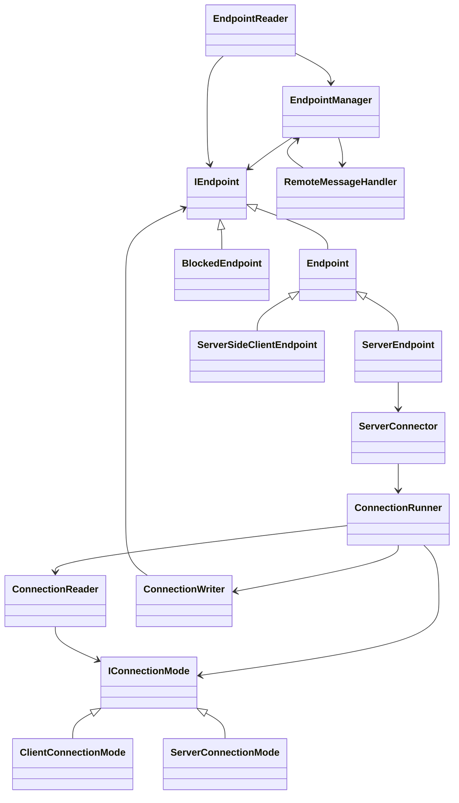

# Endpoints Overview

This directory contains the components that establish and manage connections between actor systems.
Each type below plays a specific role in accepting connections, reading and writing messages, or coordinating endpoints.

## Types

### Interfaces and Base Classes
- **`IEndpoint`** – contract for endpoint implementations; exposes outgoing channels and lifecycle hooks for remote messaging.
- **`Endpoint`** – abstract base implementing `IEndpoint`; queues outgoing messages, tracks watchers, and handles message delivery.

### Concrete Endpoints
- **`ServerEndpoint`** – `Endpoint` with an associated `ServerConnector` used for connections to other servers.
- **`ServerSideClientEndpoint`** – `Endpoint` representing a connection to a remote client actor system.
- **`BlockedEndpoint`** – inert `IEndpoint` used when an address is temporarily blocked; replies with dead‑letter or termination notices.

### Connection Management
- **`EndpointManager`** – central registry creating, tracking, and disposing `IEndpoint` instances. Handles block lists and endpoint lifecycle events.
- **`EndpointReader`** – gRPC service accepting incoming connections. Negotiates handshakes and starts per‑connection readers and writers.
- **`ServerConnector`** – sets up a `ConnectionRunner` for an address and chooses a `ClientConnectionMode` or `ServerConnectionMode`.
- **`ConnectionRunner`** – drives a bidirectional gRPC stream: performs the handshake, spawns a `ConnectionWriter` and `ConnectionReader`, and handles reconnection backoff.
- **`ConnectionReader`** – per‑connection task that processes incoming `RemoteMessage` instances using an `IConnectionMode`.
- **`ConnectionWriter`** – per‑connection task that batches and sends outgoing messages from an `IEndpoint`.
- **`RemoteStreamProcessor`** – helper with shared logic for reading, writing, and disconnecting gRPC streams.

### Connection Modes
- **`IConnectionMode`** – strategy interface for the handshake and inbound message handling.
- **`ClientConnectionMode`** – sends a client handshake and forwards messages to `RemoteMessageHandler`.
- **`ServerConnectionMode`** – sends a server handshake and logs any unexpected inbound messages.

### Messaging Helpers
- **`RemoteMessageHandler`** – deserializes `RemoteMessage` payloads and routes them to local actors.
- **`MessageBatchFactory`** – packages queued `RemoteDeliver` items into `MessageBatch` instances for transmission.
- **`EndpointWriterOptions`** – configuration for writer batch size and retry settings.

### Logging Support
- **`ConnectionRunnerLogMessages`**, **`EndpointManagerLogMessages`**, **`MessageBatchFactoryLogMessages`** – contain typed logging definitions used by their respective components.

## Relationships

The diagram illustrates the high‑level relationships between these types and how they collaborate to maintain remote communication channels.
