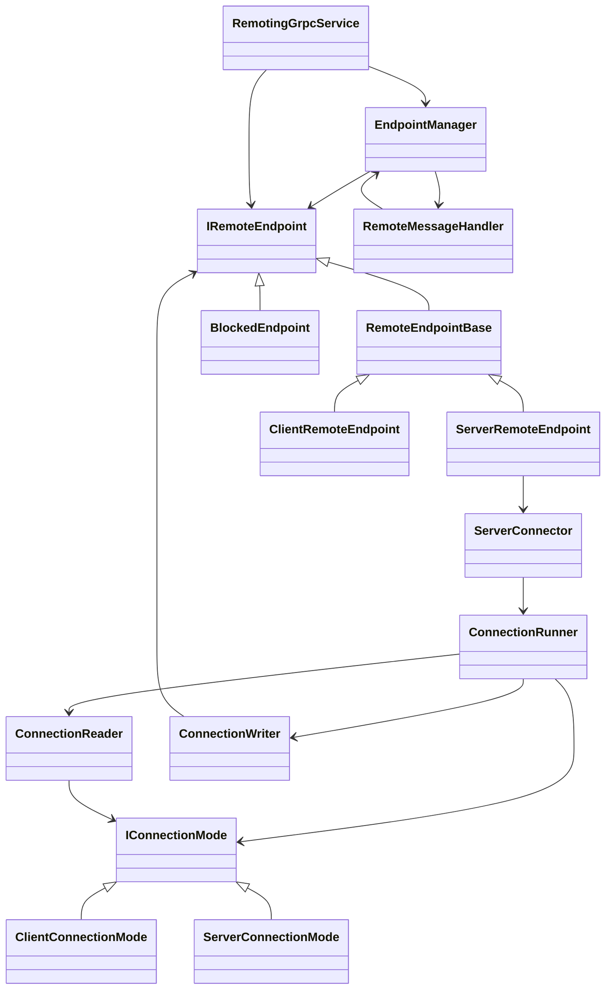
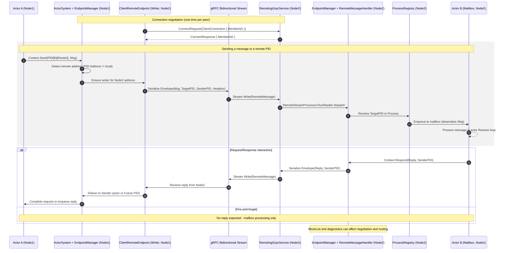

# Endpoints Overview

This directory contains the components that establish and manage connections between actor systems.
Each type below plays a specific role in accepting connections, reading and writing messages, or coordinating endpoints.

## Types

### Interfaces and Base Classes
- **`IRemoteEndpoint`** – contract for endpoint implementations; exposes outgoing channels and lifecycle hooks for remote messaging.
- **`RemoteEndpointBase`** – abstract base implementing `IRemoteEndpoint`; queues outgoing messages, tracks watchers, and handles message delivery.

### Concrete Endpoints
- **`ServerRemoteEndpoint`** – `RemoteEndpointBase` with an associated `ServerConnector` used for connections to other servers.
- **`ClientRemoteEndpoint`** – `RemoteEndpointBase` representing a connection to a remote client actor system.
- **`BlockedEndpoint`** – inert `IRemoteEndpoint` used when an address is temporarily blocked; replies with dead‑letter or termination notices.

- **`EndpointManager`** – central registry creating, tracking, and disposing `IRemoteEndpoint` instances. Handles block lists and endpoint lifecycle events.
- **`RemotingGrpcService`** – gRPC service accepting incoming connections. Negotiates handshakes and starts per‑connection readers and writers.
- **`ServerConnector`** – sets up a `ConnectionRunner` for an address and chooses a `ClientConnectionMode` or `ServerConnectionMode`.
- **`ConnectionRunner`** – drives a bidirectional gRPC stream: performs the handshake, spawns a `ConnectionWriter` and `ConnectionReader`, and handles reconnection backoff.
- **`ConnectionReader`** – per‑connection task that processes incoming `RemoteMessage` instances using an `IConnectionMode`.
- **`ConnectionWriter`** – per‑connection task that batches and sends outgoing messages from an `IRemoteEndpoint`.
- **`RemoteStreamProcessor`** – helper with shared logic for reading, writing, and disconnecting gRPC streams.

### Connection Modes
- **`IConnectionMode`** – strategy interface for the handshake and inbound message handling.
- **`ClientConnectionMode`** – sends a client handshake and forwards messages to `RemoteMessageHandler`.
- **`ServerConnectionMode`** – sends a server handshake and logs any unexpected inbound messages.

### Messaging Helpers
- **`RemoteMessageHandler`** – deserializes `RemoteMessage` payloads and routes them to local actors.
- **`MessageBatchFactory`** – packages queued `RemoteDeliver` items into `MessageBatch` instances for transmission.
- **`EndpointWriterOptions`** – configuration for writer batch size and retry settings.

### Logging Support
- **`ConnectionRunnerLogMessages`**, **`EndpointManagerLogMessages`**, **`MessageBatchFactoryLogMessages`** – contain typed logging definitions used by their respective components.

## Relationships

The diagram illustrates the high‑level relationships between these types and how they collaborate to maintain remote communication channels.

## Sequence: Cross‑Node Messaging Flow

The following sequence diagram shows how two actors on different nodes communicate using Proto.Remote over gRPC. It includes connection negotiation, message delivery, and an optional reply path.

Key components in the flow:
- ActorSystem + EndpointManager: Determines local vs remote, manages endpoints and routing.
- ClientRemoteEndpoint: Maintains writer stream to remote node; serializes outgoing envelopes.
- RemotingGrpcService: Server-side gRPC service handling negotiation and streaming I/O.
- RemoteMessageHandler: Dispatches incoming messages to local processes.
- ProcessRegistry + Mailbox: Resolves `PID` and delivers to the actor’s mailbox for processing.

Notes:
- Connection negotiation uses `ClientConnection`/`ServerConnection` and respects the block list.
- Envelopes carry target `PID`, optional `SenderPID`, headers, and message type info; serialization is configured by `RemoteConfig`.
